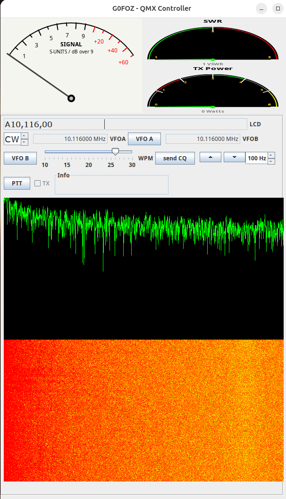
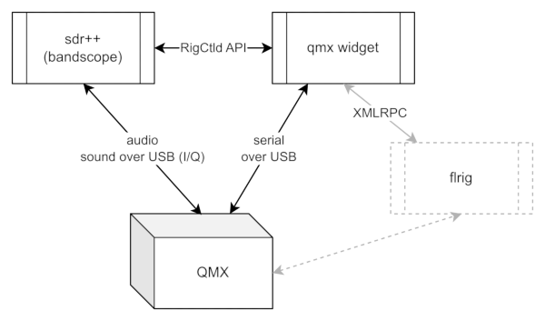

# qmxwidget



This little widget exploits the latest QMX CAT codes ( LCD read, power, swr ) to give PC control and visualisation.
It previously used FLRIG XMLRPC but now connects directly to the QMX.

The code has been modfied to send frequency data to SDR++ program via its rigctld emulation server; should an SDR++ instance not be runnign ( or not have the rigctld running it quietly ignores it)    This therefore adds a bandscope to the QMX.  If this is enabled it sends commands to the QMX to ensure audio card is in I/Q mode.  



## Running

It may be run from a single composite JAR file but requires a configuration file:

```
java -jar qmx.jar   config.json 
```
See the release assets for these files.  *do* edit the JSON configuration file before you run it.


Note:  If you want to use the band scope then download sdr++ and have this running first and ensure that:
(1) SDR++ is running with sound card ( audio ) input connected to the QMX presented sound card.
(2) SDR++ RigCTL server is running and the address/port match that in the configuration file.
see [SDR++ manual](https://www.sdrpp.org/manual.pdf)


## Configuration

Parameters are input as a configuration file in JSON format:

```
{
	"Callsign": "G0FOZ",
    "rigctldAddress": "localhost",
    "rigctldPort": 4532,
    "qmxDevice":  "/dev/QMX07"
}
```

Configuration parameters

| Parameter          | Example value | Description                                                                                               |
| :----------------- | :------------ | :-------------------------------------------------------------------------------------------------------- |
| Callsign           | G0FOZ         | Your callsign - will be used for the CQ button and other macros.                                          |
| rigctldAddress     | localhost     | SDR bandscope display frequency data                                                                      |
| rigctldPort        | 4532          | Port for frequency control of bandscope                                                                   |
| qmxDevice          | COM3          | The USB/Serial interface, will be COMx on windows, various /dev/.... on Linux/MAX | 