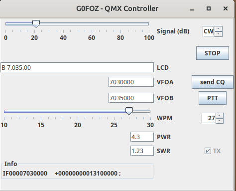

# qmxwidget

This little widget exploits the latest QMX CAT codes ( LCD read, power, swr ) and supplements the control FLRIG curently has.
It will eventuall suport two modes, direct and via Flrig but for now only XML-RPC via Flrig

