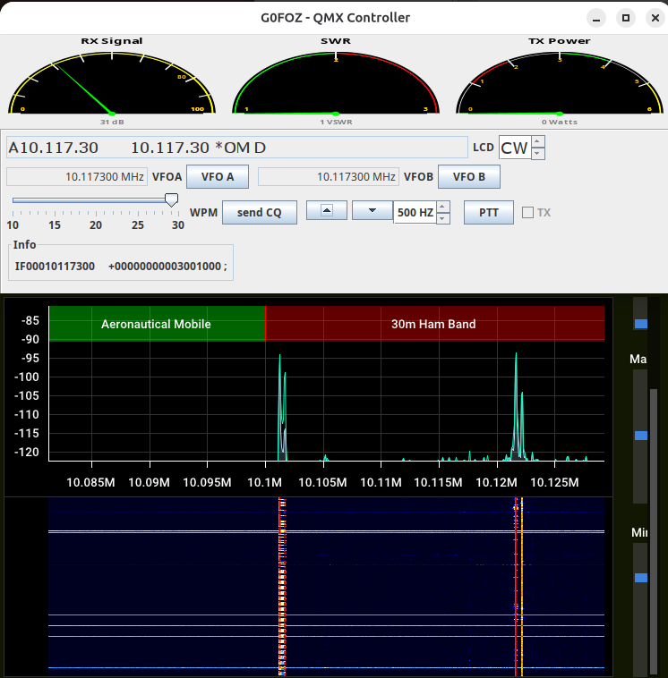

# qmxwidget


This little widget exploits the latest QMX CAT codes ( LCD read, power, swr ) and supplements the control FLRIG curently has.
It will eventually support two modes, direct and via Flrig, but for now only XML-RPC via Flrig


## Running

It may be run from a composite JAR file but requires a configuration file:  

```
java -jar qmx.jar   config.json 
```

Remember to change the parameters to suit!

## Configuration

Parameters are input as a configuration file:

```
{
	"Callsign": "G0FOZ",
	"XMLRPCaddress": "localhost",
	"XMLRPCport": "12345"
}
```


